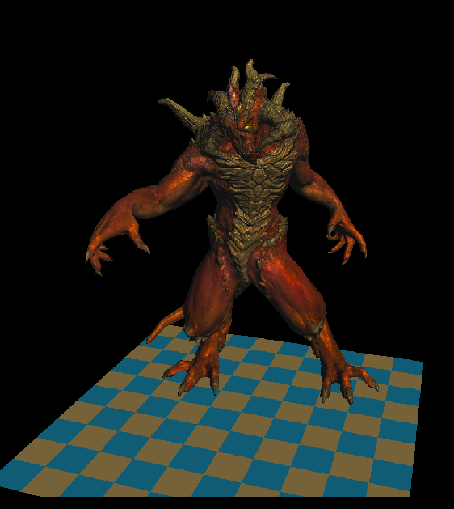
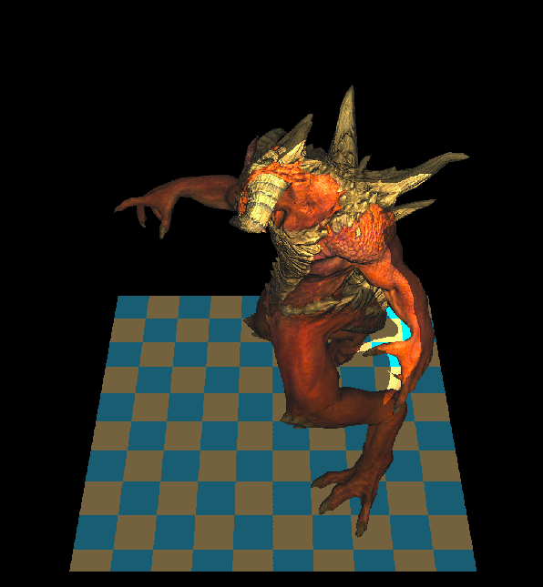

# TinyRenderer
write a tiny renderer in study, code referencer: [tinyRender](https://github.com/ssloy/tinyrenderer)

# The basic Render result

# The Render with shadow

you can find it in **shadow** branch!